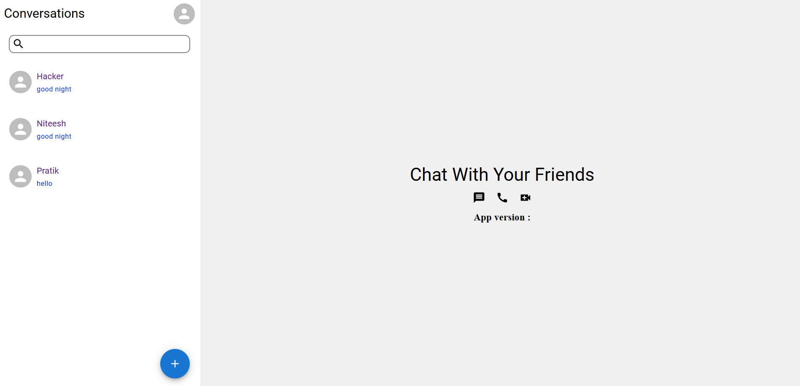

# Signal - An Real time chat application
## Overview:
Signal is a real-time chat application that ensures reliable message delivery and seamless user experience.

## Key Features:

- Real-Time Messaging: Uses Socket.io for instantaneous message delivery between users.
- Offline Messaging: When users are offline, the server uses web push notifications to ensure messages are reliably delivered.
- Offline Data Storage: Implements IndexedDB for storing messages and data locally when offline.
- Authentication and Authorization: Secure login and user management.

## Technologies Used:
- Socket.io
- Web Push Notifications
- MERN Stack (MongoDB, Express.js, React, Node.js)
- IndexedDB

## Visit our appliaction
https://signalmessenger.netlify.app/

Note: Due to Security Reasons We have Restricted the SignUp processs so please use it only for preview purpose.

